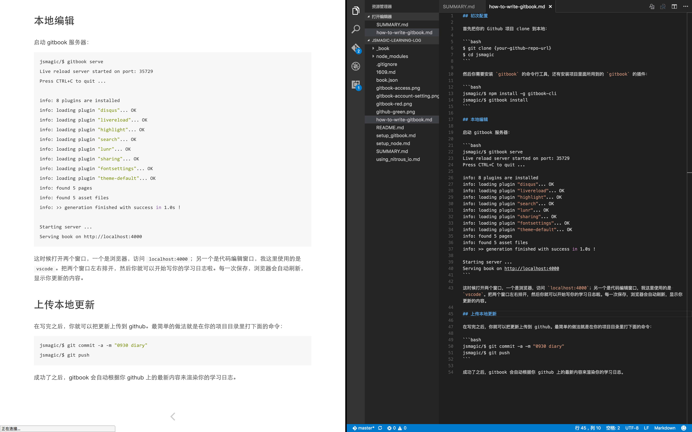

[gitbook.com](gitbook.com) 本来是可以直接在线编辑的，非常方便，也能实时看到你的修改。但是不知为何 gitbook.com 的服务器连接非常蛋疼，无论是翻墙还是不翻墙。所以这里推荐大家还是在本地写自己的学习日志，然后上传到 github。

## 初次配置

首先把你的 Github 项目 clone 到本地：

```bash
$ git clone {your-github-repo-url}
$ cd jsmagic
```

## 本地编辑

给大家介绍两种方式，第一种比较文艺，第二种比较普通。

### 使用 gitbook 命令行工具（文艺方式）

你需要安装 `gitbook` 的命令行工具，还有安装项目里面所用到的 `gitbook` 的插件：

```bash
jsmagic/$ npm install -g gitbook-cli
jsmagic/$ gitbook install
```

启动 gitbook 服务器：

```bash
jsmagic/$ gitbook serve
Live reload server started on port: 35729
Press CTRL+C to quit ...

info: 8 plugins are installed
info: loading plugin "disqus"... OK
info: loading plugin "livereload"... OK
info: loading plugin "highlight"... OK
info: loading plugin "search"... OK
info: loading plugin "lunr"... OK
info: loading plugin "sharing"... OK
info: loading plugin "fontsettings"... OK
info: loading plugin "theme-default"... OK
info: found 5 pages
info: found 5 asset files
info: >> generation finished with success in 1.0s !

Starting server ...
Serving book on http://localhost:4000
```

这时候打开两个窗口，一个是浏览器，访问 `localhost:4000`；另一个是代码编辑窗口，我这里使用的是 `vscode`。把两个窗口左右排开，然后你就可以开始写你的学习日志啦。每一次保存，浏览器会自动刷新，显示你更新的内容。



### 使用一个 markdown 编辑器 （普通方式）

市面上的 markdown 编辑器很多，推荐我们思客的小伙伴[轮子哥](https://github.com/egoist)写的 EME 编辑器。只要打开 .md 文件，直接编辑，然后保存就可以了。

## 上传本地更新

在写完之后，你就可以把更新上传到 github。最简单的做法就是在你的项目目录里打下面的命令：

```bash
jsmagic/$ git commit -a -m "0930 diary"
jsmagic/$ git push
```

成功了之后，gitbook 会自动根据你 github 上的最新内容来渲染你的学习日志。