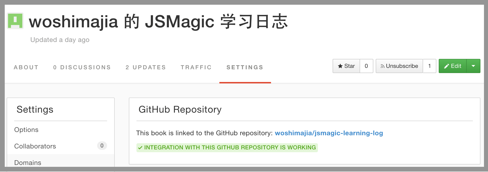

# 设置自己的学习日志 (Gitbook)

<video style="width:100%" controls>
  <source src="http://7xslga.com1.z0.glb.clouddn.com/jsmagic-gitbook.mp4" type="video/mp4">
  Your browser does not support HTML5 video.
</video>

## 步骤

1. fork 这个[模版仓库](https://github.com/Mr-Wiredancer/jsmagic-learning-log)；
2. 用你的 github 账户登录 [gitbook 网站](gitbook.com)；
3. 创建一个新的 gitbook，创建时选择从 github 创建，并选择你在步骤 1 中 fork 的目录
4. 把 README.md 中的 [XXX](https://github.com/xxx) 换成你自己的 github id，并且删掉"配置你自己的学习日志" 这个部分
5. 这样你就完成了学习日志的创建。你可以通过 gitbook 自己的在线编辑器(最近的访问速度略蛋疼)来写学习日志。我更加建议的方式是把 github repo clone 到本地，在本地使用 markdown 编辑器或者 gitbook 的命令行工具来进行实时编写，然后再上传到 github。

## 坑00 - gitbook 创建花了十年
gitbook 的创建一般就花几分钟，但也有遇到过几天还显示没有成功的(再一次吐槽一下 gitbook 的服务器质量...)。解决方法：

1. 删掉原有 gitbook, 从新创建一个；
2. 直接尝试访问 https://{your-github-id}.gitbooks.io/{gitbook-name}/content，如果能看到内容的话可以忽略 gitbook 的提示。

## 坑01 - gitbook 和 github 之间的连接没有获得授权
你会看到如下图的错误：

这时候你需要做的是在 gitbook 网站里点选右上角的你的头像，然后选择 "Account Settings"：

在打开的页面中，一直往下滚动到 "Github" 的一栏。点击 "Reconnect Github Account"，然后在下拉菜单中选择 "With access to public repository"：

现在回到最开始的页面，你会看到红字变成了绿字：

这样 gitbook 和 github 就成功连接，你在任意一边做的修改都会自动同步。

遇到坑的同学可以在评论里补充，我会持续更新这篇文章

